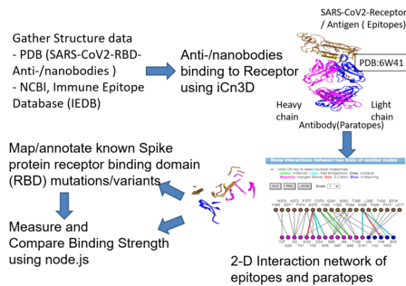

RBD Explorer 
 
What is the problem we are trying to solve? 
Comparing the structures of antibodies and nanobodies relative to each other in a 3D and 2D visualization platform with respect to SARS-CoV2 spike glycoprotein will allow us to understand the details of the intermolecular interactions.  
 
Why should we solve it? 
Antibodies are widely used in a number of applications. Understanding the particular residue or domain epitopes-paratopes interactions can help in predicting binding interactions which can assist in the area of drug design. A functional understanding of antibody-nanobody interactions within the  SARS-CoV2 RBD domain with computational tools can complement and accelerate the area of therapeutics. The calculation of binding strenghts and interaction energy for the variants of interest with position matching epitopes and paratopes will be of interest as we visually probe and compare using the 2-D interaction networks.  
Reference literature:  IEDB, NCBI, NextStrain, CovabDAB, RCSB, Uniprot 
 
Proposed Workflow 
 

Next steps:  
Pmanuscript submission:  
https://drive.google.com/file/d/1U_Ten5iqmAfmZRe8VVgt3wUHZUq-mqpg/view?usp=sharing
 
Team members name: Elzbieta Gralinska, Sachendra Kumar, Giovanni Madeo, Luis Jaimes Santiago, Sheela Vemu, Sandra Porter and Todd Smith 
